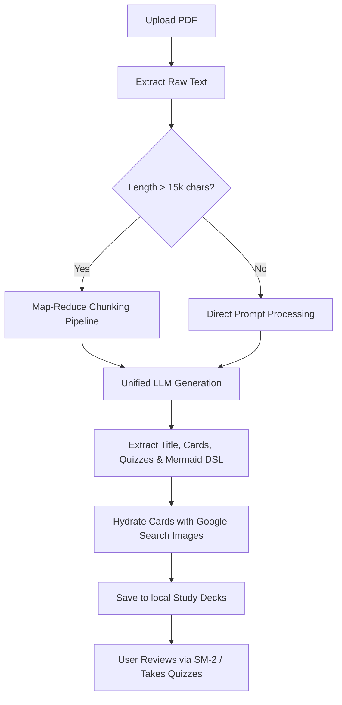

# ReLian

**🏆 Awarded 1st place: CEDT Innovation Summit 2025**

**📜 Honorable mention finalist: National Software Contest 2025**


**ReLian** is an intelligent, AI-powered spaced repetition flashcard and learning companion application. It streamlines the learning process by transforming raw study documents into structured, visual, and highly interactive study decks. 

By leveraging advanced LLMs and memory science, ReLian optimizes long-term knowledge retention and adapts to individual study preferences.

## Features

- **AI Flashcard Generation**: Simply upload a PDF, and ReLian's AI extracts main concepts to generate high-quality flashcards.


- **Visual Mind-Maps**: Automatically constructs visual diagrams using **Mermaid.js** within the study deck summaries, mapping out concept relationships.


- **Contextual Image Hydration**: Cards are automatically enriched with relevant illustrations retrieved using Google Custom Search API.


- **Spaced Repetition System (SRS)**: Uses the industry-standard **SM-2 algorithm** (SuperMemo 2) to dynamically calculate card review intervals based on difficulty ratings.


- **Interactive Quizzes**: Generates open-ended review quizzes customized to the uploaded material with AI grading.


- **Bloom's Taxonomy Adaptations**: Automatically tags card difficulty/concept level (Remembering, Understanding, Applying, etc.) and allows generating related follow-up cards.

- **On-Demand AI Explanations**: Reviewing a tricky card? Request a concise, educational AI explanation for any card's question-and-answer pair.


- **Gamification & Community**: Adding incentive to learn more and grow together.


## How It Works



1. **PDF Processing & Text Extraction**: When a document is uploaded, text is extracted via `pdf-parse`. If the text size is particularly large (>15,000 characters), it runs through a recursive map-reduce pipeline to summarize concepts before generation.
2. **Unified AI Generation**: ReLian queries Groq AI endpoints to produce structured JSON payloads containing deck meta-information, flashcards, multiple-choice questions, and Mermaid graph syntax.
3. **Image Hydration**: The backend triggers Google Custom Search to obtain visual aids for terms flagged as `needs_image`, providing a multi-sensory studying experience.
4. **Active Learning Interface**: Decks are served to the client, where users can study flashcards, receive instant scores, view diagrams, run quizzes, or prompt the AI for localized explanations.

---

## Try it out
You can check out the live version of the project here: **[https://relian-psi.vercel.app/](https://relian-psi.vercel.app/)**

---

## Steps to Download and Run Locally

Ensure you have [Node.js](https://nodejs.org/) installed on your machine.

### 1. Clone and Navigate to the Repository

```bash
git clone <repository-url>
cd "Brillian Flashcards"
```

### 2. Configure and Run the Backend

1. Navigate to the `backend/` directory:
   ```bash
   cd backend
   ```
2. Install dependencies:
   ```bash
   npm install
   ```
3. Create a `.env` file in the `backend/` directory:
   ```env
   GROQ_API_KEY=your_groq_api_key
   GOOGLE_API_KEY=your_google_custom_search_api_key
   GOOGLE_CX=your_google_custom_search_cx_key
   PORT=5001
   ```
4. Start the backend developer server:
   ```bash
   npm run dev
   ```
   *The server will run at `http://localhost:5001`.*

### 3. Configure and Run the Frontend

1. Navigate to the `frontend/` directory (from the root):
   ```bash
   cd ../frontend
   ```
2. Install dependencies:
   ```bash
   npm install
   ```
3. Create a `.env.local` file in the `frontend/` directory:
   ```env
   VITE_API_URL=http://localhost:5001
   ```
4. Start the frontend development server:
   ```bash
   npm run dev
   ```
   *The frontend will run at `http://localhost:5173`.*

---

## ℹ️ About This Demo

> [!IMPORTANT]
> To ensure optimal performance and server-resource management during the demo:
> - **Supported File Formats**: Only **PDF** documents (`.pdf`) are supported.
> - **File Size Limit**: Documents must have a file size of **less than 2MB**.
